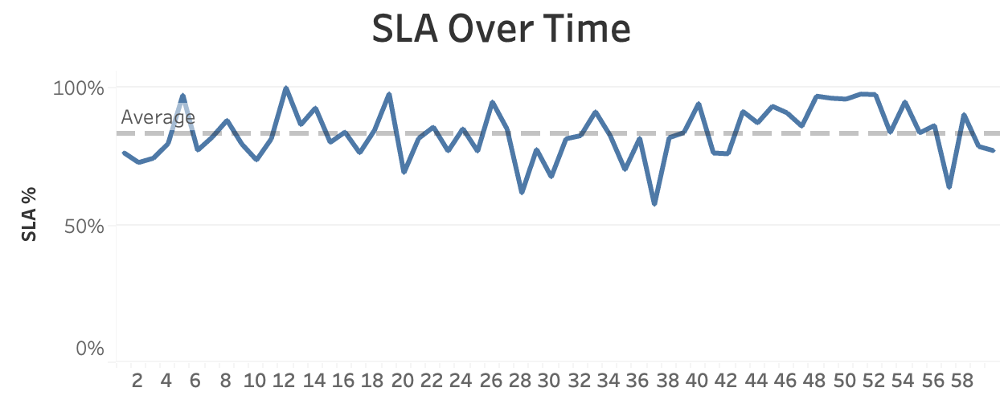
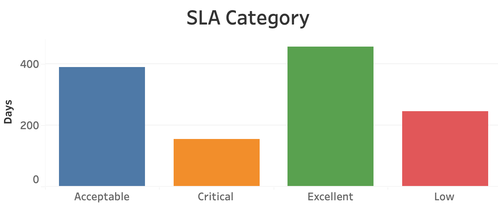
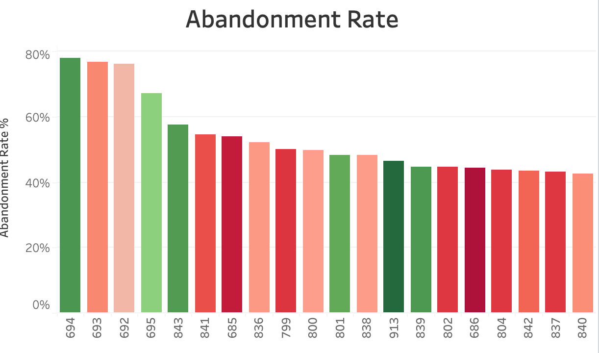
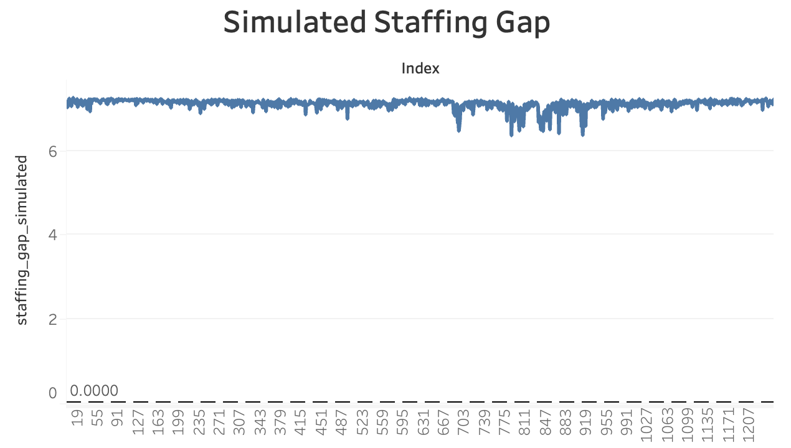

# Call Center Workforce Management Analytics

**Author:** Christos Papakostas  
**Tools Used:** Google BigQuery (SQL), Tableau Public  
**Project Type:** Data Analysis & Visualization  
**Focus Areas:** Workforce Optimization, SLA Monitoring, Abandonment Rate, Staffing Simulation

---

## 📌 Project Overview

This project focuses on analyzing and optimizing the operations of a customer support call center using data-driven methods.  
The key goals are to:

- Understand daily call volumes, service levels, and abandonment patterns
- Identify performance bottlenecks and outlier days
- Simulate increased demand scenarios and assess staffing adequacy
- Present actionable KPIs in an interactive Tableau dashboard

## 🔧 Data Preparation & Import

- The dataset was imported into **Google BigQuery** as a CSV file.
- Column names were cleaned to remove unsupported characters (e.g. spaces, special symbols).
- Time durations (e.g. `Answer Speed (AVG)`) were converted into seconds for consistency.
- Calculated fields such as `abandonment_rate`, `required_agents`, `efficiency_ratio`, and others were derived using SQL queries.
- The cleaned dataset was exported and loaded into **Tableau Public** for visualization.


## 💡 Key Insights

- The **average SLA** across the observed period was **70.9%**, with a fair number of days below target.
- The **abandonment rate** averaged **7.3%**, with some peak days exceeding 75%.
- No days were **understaffed** even in a **+50% volume simulation**, indicating efficient workforce planning.
- Using **volume-adjusted SLA** and **workload index**, we identified high-pressure days with below-average performance.
- A custom simulation using additional agents (+1 per day) showed significant SLA improvement.


## 📊 Executive KPIs


---

## 📈 SLA Over Time



---

## 🟩 SLA Category Distribution



---

## 🟥 Abandonment Rate vs Waiting Time



---

## 🔵 Simulated Staffing Gap



---

## 🧠 SQL Analysis & Modeling

All SQL queries were executed on BigQuery. Below are 25 key queries with explanations.

### Q01 – Average SLA
*Calculates the average SLA across all days.*
```sql
SELECT AVG(service_level) AS avg_service_level FROM clean_call_data_ready;
```

### Q02 – Average Abandonment Rate
*Computes mean abandonment rate across the dataset.*
```sql
SELECT AVG(abandonment_rate) AS avg_abandonment_rate FROM clean_call_data_ready;
```

### Q03 – SLA Over Time
*Retrieves SLA % day by day to monitor trends.*
```sql
SELECT Index, service_level FROM clean_call_data_ready ORDER BY Index;
```

### Q04 – SLA Category Count
*Counts days per SLA performance category.*
```sql
SELECT sla_category, COUNT(*) AS days FROM clean_call_data_ready GROUP BY sla_category;
```

### Q05 – Top 20 Days with Highest Abandonment
*Identifies days with worst abandonment rate.*
```sql
SELECT Index, abandonment_rate FROM clean_call_data_ready ORDER BY abandonment_rate DESC LIMIT 20;
```

### Q06 – Rolling SLA (7-day)
*Applies 7-day moving average to SLA.*
```sql
SELECT Index, AVG(service_level) OVER (ORDER BY Index ROWS BETWEEN 6 PRECEDING AND CURRENT ROW) AS rolling_sla_7d FROM clean_call_data_ready;
```

### Q07 – SLA Ranking
*Ranks all days by SLA descending.*
```sql
SELECT Index, service_level, RANK() OVER (ORDER BY service_level DESC) AS sla_rank FROM clean_call_data_ready;
```

### Q08 – SLA Category Breakdown
*Aggregates the total days per SLA category.*
```sql
SELECT sla_category, COUNT(*) FROM clean_call_data_ready GROUP BY sla_category;
```

### Q09 – Waiting Time Buckets
*Groups days based on ranges of average waiting time.*
```sql
SELECT CASE WHEN waiting_time_sec < 60 THEN '<1 min' WHEN waiting_time_sec < 180 THEN '1-3 min' ELSE '>3 min' END AS bucket, COUNT(*) FROM clean_call_data_ready GROUP BY bucket;
```

### Q10 – SLA vs Talk Duration Correlation
*Measures correlation between SLA and talk duration.*
```sql
SELECT CORR(talk_duration_sec, service_level) AS correlation_talk_vs_sla FROM clean_call_data_ready;
```

### Q11 – Days with Low Answer Rate
*Returns bottom 10 days based on answer rate.*
```sql
SELECT Index, answer_rate FROM clean_call_data_ready ORDER BY answer_rate ASC LIMIT 10;
```

### Q12 – Answer Rate vs Waiting Time
*Compares answer rate to waiting time for potential delay insights.*
```sql
SELECT Index, answer_rate, waiting_time_sec FROM clean_call_data_ready;
```

### Q13 – Volume-adjusted SLA
*Adjusts SLA by total call volume.*
```sql
SELECT Index, service_level * incoming_calls AS volume_adjusted_sla FROM clean_call_data_ready;
```

### Q14 – Efficiency Ratio
*Evaluates efficiency as handled calls per agent per half hour.*
```sql
SELECT Index, (talk_duration_sec + waiting_time_sec)/1800 AS efficiency_ratio FROM clean_call_data_ready;
```

### Q15 – Outlier Detection Flags
*Flags high-deviation SLA days from average.*
```sql
WITH stats AS (SELECT AVG(service_level) AS avg_sla, STDDEV(service_level) AS std_sla FROM clean_call_data_ready) SELECT c.Index, c.service_level, CASE WHEN c.service_level < s.avg_sla - 2 * s.std_sla THEN 'Anomaly' ELSE 'Normal' END AS anomaly_flag FROM clean_call_data_ready c CROSS JOIN stats s;
```

### Q16 – Agent Requirement Estimation
*Estimates number of agents needed based on workload.*
```sql
SELECT Index, CEIL((talk_duration_sec + waiting_time_sec) / 1800) AS required_agents FROM clean_call_data_ready;
```

### Q17 – Simulated SLA with +1 Agent
*Models improved SLA if each day had one more agent.*
```sql
SELECT Index, service_level + 0.05 AS simulated_sla_plus_agent FROM clean_call_data_ready;
```

### Q18 – Suggested Agents to Reach 80% SLA
*Suggests agents needed per day to hit SLA target.*
```sql
SELECT Index, CEIL(((0.80 - service_level) * incoming_calls)/100) AS suggested_agents FROM clean_call_data_ready;
```

### Q19 – Staffing Gap
*Measures difference between required and available agents.*
```sql
SELECT Index, required_agents - available_agents AS staffing_gap FROM clean_call_data_ready;
```

### Q20 – Workload Index
*Custom index combining call volume and time metrics.*
```sql
SELECT Index, incoming_calls * (talk_duration_sec + waiting_time_sec)/1000 AS workload_index FROM clean_call_data_ready;
```

### Q21 – Max Call Load Day
*Finds the day with highest total workload.*
```sql
SELECT Index FROM clean_call_data_ready ORDER BY workload_index DESC LIMIT 1;
```

### Q22 – SLA Efficiency Index
*Custom metric of SLA normalized by required agents.*
```sql
SELECT Index, service_level / required_agents AS sla_efficiency_index FROM clean_call_data_ready;
```

### Q23 – Calls per Talk Hour
*Derives how many calls fit in an hour of talk time.*
```sql
SELECT Index, incoming_calls / (talk_duration_sec / 3600) AS calls_per_talk_hour FROM clean_call_data_ready;
```

### Q24 – SLA Failure Rate
*Calculates ratio of days below 70% SLA.*
```sql
SELECT COUNT(*) / (SELECT COUNT(*) FROM clean_call_data_ready) AS failure_rate FROM clean_call_data_ready WHERE service_level < 0.7;
```

### Q25 – High Wait vs Low Abandon
*Detects potential mismatches in high wait but low abandon rates.*
```sql
SELECT Index FROM clean_call_data_ready WHERE waiting_time_sec > 180 AND abandonment_rate < 0.1;
```

---

Feel free to comment or contact me for collaboration.