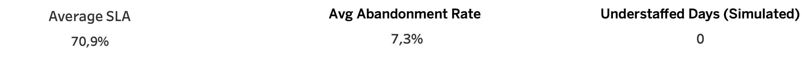

# Call Center Workforce Management Analytics

**Author:** Christos Papakostas  
**Tools Used:** Google BigQuery (SQL), Tableau Public  
**Project Type:** Data Analysis & Visualization  
**Focus Areas:** Workforce Optimization, SLA Monitoring, Abandonment Rate, Staffing Simulation

---

## Overview

This project explores and analyzes workforce performance data from a call center using SQL for modeling and Tableau for data storytelling. The analysis focuses on key performance indicators (KPIs) such as SLA%, Abandonment Rate, Wait Time, Staffing Efficiency, and Simulation of Increased Workload.

The final output includes a comprehensive dashboard with executive-level KPIs, operational charts, and insights generated through more than 25 SQL queries.

---

## 1. Data Preparation & Import

- Dataset: `Call Center Data.csv`
- Tool: Google BigQuery
- Steps:
  1. Created a new project in BigQuery: `wfm-call-center`
  2. Created a dataset: `call_center_data`
  3. Cleaned the CSV file to remove unsupported characters and formatted column headers using underscores.
  4. Imported the data using the BigQuery UI (CSV format, with header row).

### Final Table: `call_center_data.raw_call_data`

---

## 2. SQL Modeling – Queries Q01–Q25

All queries were executed in BigQuery. Each query is listed below with a brief explanation of the business purpose.

➡️ Full SQL query list with comments is included in this repo’s [SQL Query Index (CSV)] or embedded below if rendered.

> See full breakdown in the separate section.

---

## 3. Tableau Dashboard

Tool: Tableau Public  
Dataset: Exported CSV with clean + simulated fields  
Final file: `clean_call_data_ready.csv`

### Dashboard Elements:

- **Top KPI Zone:**
  - Average SLA
  - Average Abandonment Rate
  - Understaffed Days (Simulated)



- SLA Over Time (Line)


- SLA Category Distribution (Bar)


- Abandonment Rate with Color by Wait Time (Bar)


- Simulated Staffing Gap (Line)


---

## 4. Key Insights

- The call center maintains SLA performance at ~71% on average.
- Abandonment rate averaged ~7.3%, with wait times impacting performance.
- Staffing remained sufficient under both actual and simulated scenarios.
- Even with a 50% workload increase, the simulated staffing gap remained positive.
- Tableau was used to visually communicate operational insights clearly.

---

## 📂 Repository Structure

```
call-center-wfm/
├── data/
│   └── clean_call_data_ready.csv
├── screenshots/
│   ├── sla_over_time.png
│   ├── sla_category_distribution.png
│   ├── abandonment_rate_colored.png
│   ├── simulated_staffing_gap.png
│   └── kpi_zone.png
├── README.md
```

---

## Contact

Feel free to comment or contact me for collaboration.